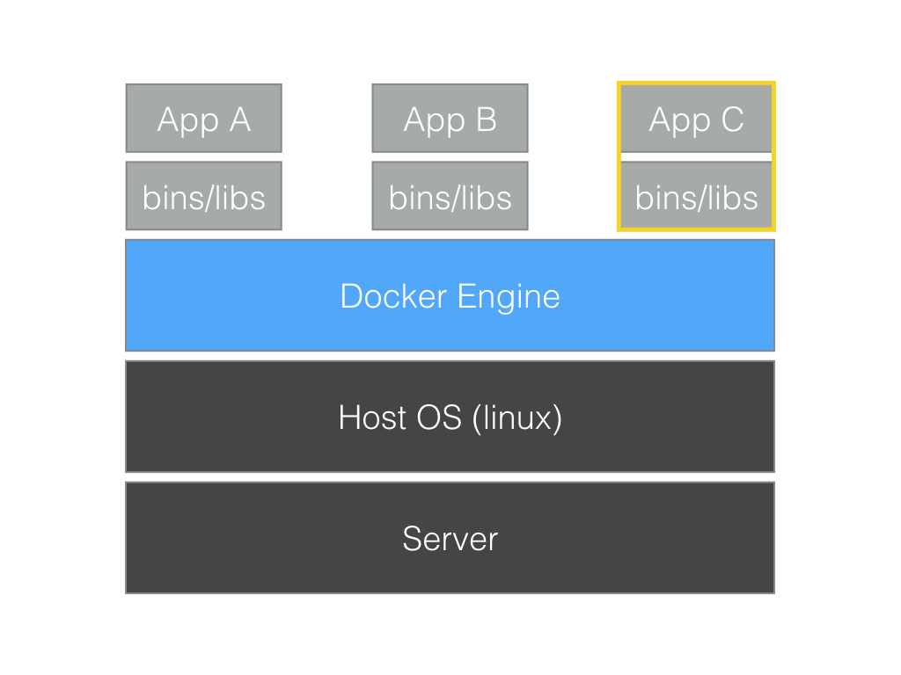
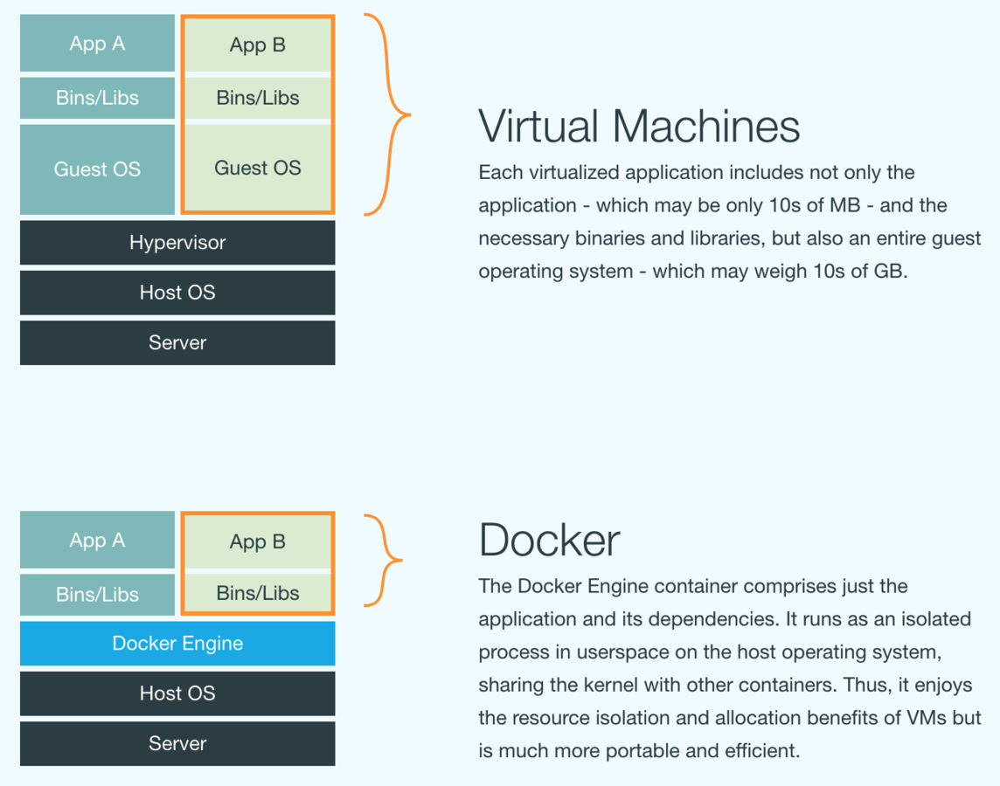
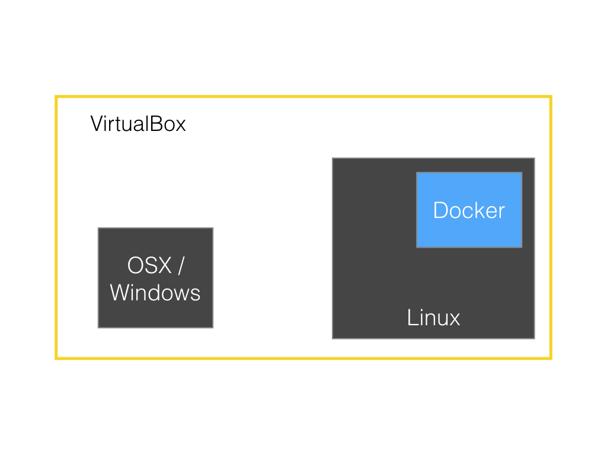
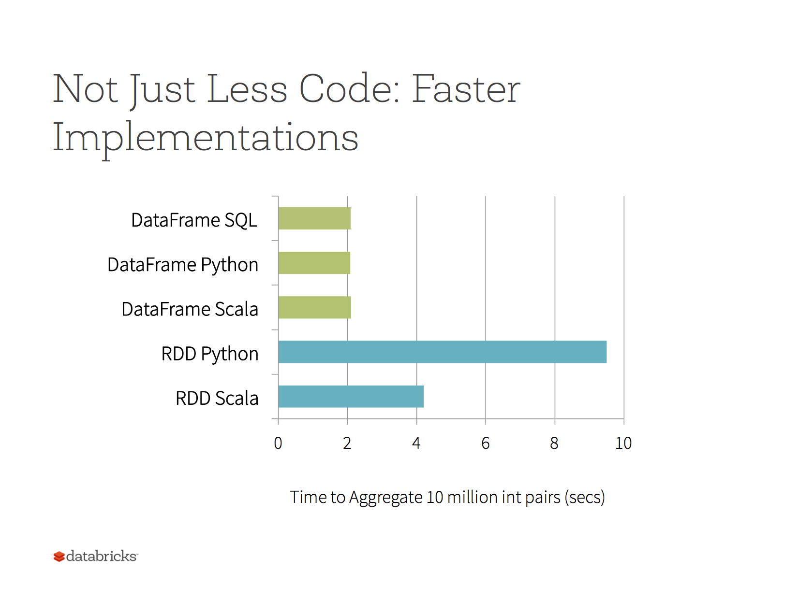
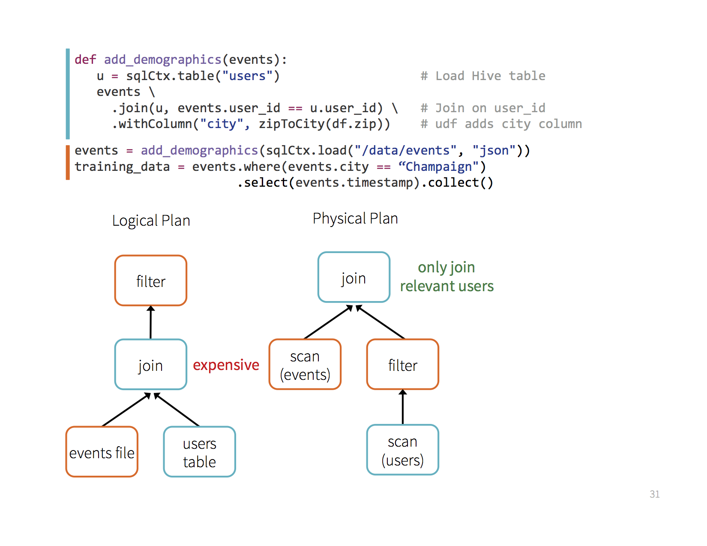
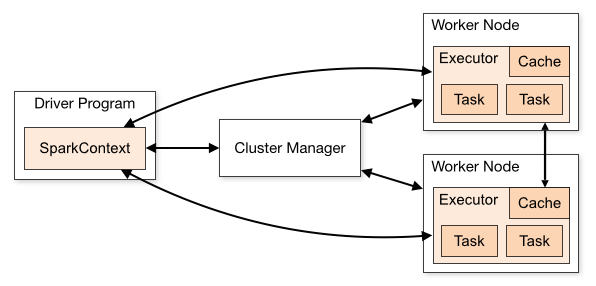
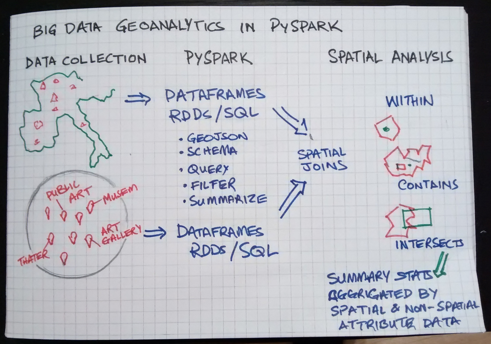
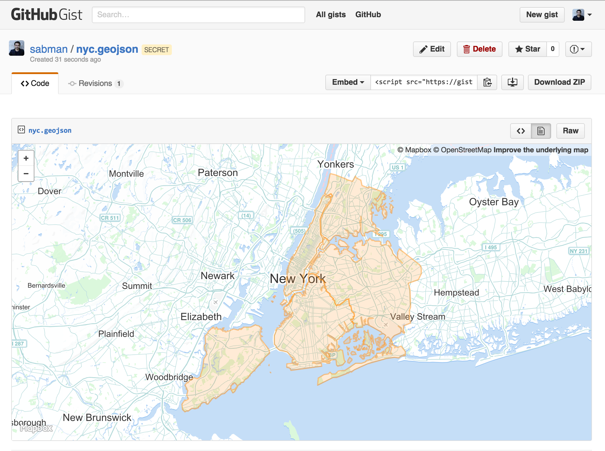

# Workshop Geospatial Analysis with PySpark

## Shoaib Burq & Kashif Rasul
### @sabman / @krasul

^ Thank everyone for coming
^ Introduce myself

---

# [fit] Getting Setup :v:

---
## Wifi

* Connect to

## Windows and Mac Users: Install Docker Toolbox

* Download at https://www.docker.com/products/docker-toolbox

---

## Start Docker Instance

Follow instructions here:

`https://github.com/sabman/PySparkGeoAnalysis/blob/master/docker/README.md`


---

# Introduction to Docker
# :whale:

^ we are going to be using Docker to setup today so lets do a 20 min primer to Docker
^ We will do the following:

---
## Docker Agenda

* What is Docker?
* How to use Docker Toolbox
* Install on Mac and Windows

---
## What is Docker

* Linux Containers
* Instances of environments

^ Creates Instances of environments
^ Configured environments use them save their states
^ Ideas of images and containers

---



^ It's linux based Software. It creates environments that can be used across different machines.
^ Docker runs in linux, inside docker we have an image (like a class) and containers (like instance of class). These are driven by docker File.
^ Dockerfile -> Image -> Container(s)
^ we can save state on containers and move them across machines too.

---



^ Lets look at the structure of docker.
^ you have a Linux machine inside that you have docker running.

---

# Docker Toolbox

* Download at https://www.docker.com/products/docker-toolbox
* All the things you need for Mac or Windows

---

# Docker Toolbox

* Docker Engine
* Docker Client
* Docker Machine
* Docker Compose
* Docker Kitematic
* VirtualBox

^ Docker Engine: Run time for docker (bin/libs, Apps)
^ Docker Client: communicate with docker
^ Docker Machine: Provisioning and communicate between docker client and engine
^ Docker Compose: Manage Multiple Containers
^ Kitematic: GUI
^ VirtualBox: Lightweight VM

---



---


## About me

Shoaib Burq (twitter: @sabman)

* :school: Geomatics Engineer and Software Developer
* :whale: Underwater mapping & ...
* :fire: Disaster Response work for Australian Gov.
* :airplane:: Moved to Berlin 2011
* :sweat: Startup with some awesome people (dataX)

---

# [fit] :school: datax.academy

---

## Team dataX

* Stafan Berntheisel (big data engineer)
* Dr Kashif Rasul (deep learning)
* Sergey Vandyshev (machine learning)
* Leo Marose (business/analyst)


---
# What is Apache Spark
## The big picture

^ Apache Spark is an in memory data processing and analysis library that is made up of the following parts:

---


^ Apache Spark is a fast and general-purpose cluster computing system. It provides high-level APIs in Java, Scala, Python and R, and an optimized engine that supports general execution graphs. It also supports a rich set of higher-level tools including Spark SQL for SQL and structured data processing, MLlib for machine learning, GraphX for graph processing, and Spark Streaming.


---
# PySpark :snake: :sparkles:
## internals

---


^PySpark is built on top of Spark's Java API. Data is processed in Python and cached / shuffled in the JVM. In the Python driver program, SparkContext uses Py4J to launch a JVM and create a JavaSparkContext. Py4J is only used on the driver for local communication between the Python and Java SparkContext objects; large data transfers are performed through a different mechanism. RDD transformations in Python are mapped to transformations on PythonRDD objects in Java. On remote worker machines, PythonRDD objects launch Python subprocesses and communicate with them using pipes, sending the user's code and the data to be processed.


^ Pickle with try to create a function closure and serialize it. In order for the JVM to communicate with Python/PySpark we need to able to pickle functions and take our data and translate it into bytes.

---

# SparkSQL / DataFrames

---
# Write less code


```
# RDD Version:
data = sc.textFile(...).split("\t")
data.map(lambda x: (x[0], [int(x[1]), 1])) \
  .reduceByKey(lambda x, y: [x[0] + y[0], x[1] + y[1]]) \
  .map(lambda x: [x[0], x[1][0] / x[1][1]]) \
  .collect()

# DataFrames Version:
sqlCtx.table("people") \
   .groupBy("name") \
   .agg("name", avg("age")) \
   .collect()
```

---



---
## Optimization happens as late as possible, therefore Spark SQL can optimize across functions :v:

---



---


# Shared Variables


^ Normally, when a function passed to a Spark operation (such as map or reduce) is executed on a remote cluster node, it works on separate copies of all the variables used in the function. These variables are copied to each machine, and no updates to the variables on the remote machine are propagated back to the driver program. Supporting general, read-write shared variables across tasks would be inefficient. However, Spark does provide two limited types of shared variables for two common usage patterns: broadcast variables and accumulators.


# Broadcast Variables

```python
>>> broadcastVar = sc.broadcast([1, 2, 3])
<pyspark.broadcast.Broadcast object at 0x102789f10>

>>> broadcastVar.value
[1, 2, 3]
```

^Broadcast variables allow the programmer to keep a read-only variable cached on each machine rather than shipping a copy of it with tasks. They can be used, for example, to give every node a copy of a large input dataset in an efficient manner. Spark also attempts to distribute broadcast variables using efficient broadcast algorithms to reduce communication cost.

^Spark actions are executed through a set of stages, separated by distributed “shuffle” operations. Spark automatically broadcasts the common data needed by tasks within each stage. The data broadcasted this way is cached in serialized form and deserialized before running each task. This means that explicitly creating broadcast variables is only useful when tasks across multiple stages need the same data or when caching the data in deserialized form is important.

^Broadcast variables are created from a variable v by calling SparkContext.broadcast(v). The broadcast variable is a wrapper around v, and its value can be accessed by calling the value method. The code below shows this:

---

# Running Spark on Clusters

---



^ Each application gets its own executor processes, which stay up for the duration of the whole application and run tasks in multiple threads. This has the benefit of isolating applications from each other, on both the scheduling side (each driver schedules its own tasks) and executor side (tasks from different applications run in different JVMs). However, it also means that data cannot be shared across different Spark applications (instances of SparkContext) without writing it to an external storage system.
^ Spark is agnostic to the underlying cluster manager. As long as it can acquire executor processes, and these communicate with each other, it is relatively easy to run it even on a cluster manager that also supports other applications (e.g. Mesos/YARN).
^ The driver program must listen for and accept incoming connections from its executors throughout its lifetime (e.g., see spark.driver.port and spark.fileserver.port in the network config section). As such, the driver program must be network addressable from the worker nodes.
^ Because the driver schedules tasks on the cluster, it should be run close to the worker nodes, preferably on the same local area network. If you’d like to send requests to the cluster remotely, it’s better to open an RPC to the driver and have it submit operations from nearby than to run a driver far away from the worker nodes.

---

## Cluster Archtecture

---

# :sparkles: & :globe_with_meridians:

## What's happening in Spark and GeoAnalysis

---

# Current Options

* Magellan `harsha2010/magellan`
* GeoSpark `DataSystemsLab/GeoSpark`
* SpatialSpark `syoummer/SpatialSpark`
* Spark kNN Graphs `tdebatty/spark-knn-graphs`

^

---

# [fit] Big Picture :cloud:

---



---

# [fit] Our Data

## lets explore...

---

# [fit] :globe_with_meridians: + :panda_face: = GeoPandas

## http://geopandas.org

^ GeoPandas is an open source project to make working with geospatial data in python easier. GeoPandas extends the datatypes used by pandas to allow spatial operations on geometric types. Geometric operations are performed by shapely. Geopandas further depends on fiona for file access and descartes and matplotlib for plotting.


---


## Make working with geographic data like working with other kinds of data in python

Work with existing tools:

* Desktop GIS (ArcGIS, QGIS)
* Geospatial databases (e.g., PostGIS)
* Web maps (Leaflet, D3, etc.)
* Python data tools (pandas, numpy, etc.)

---

## Supports

* Geometry operations (Shapely)
* Data alignment (pandas)
* Coordinate transformations (pyproj)
* Read/write GIS file formats (Fiona)
* Create a GeoDataFrame from PostGIS table
* Output any object as geoJSON
* Plotting

---

## GeoPandas depends on

* Python (2.6, 2.7, 3.3+)
* Pandas (0.13 and up)
* Shapely (GEOS)
* Fiona (GDAL/OGR)
* Pyproj (PROJ.4)
* Matplotlib (and Descartes)
* psycopg2, sqlalchemy, geopy, rtree (optional)

---

## It can do

* Geometry operations (Shapely)
* Data alignment (pandas)
* Coordinate transformations (pyproj)
* Read/write GIS file formats (Fiona)
* Create a GeoDataFrame from PostGIS table
* Output any object as GeoJSON
* Plotting

---

##GeoPandas Data Structures

### Pandas :arrow_right: GeoPandas

* Series (1-D) :arrow_right: GeoSeries (1-D)
* DataFrame (2-D table) :arrow_right: GeoDataFrame (2-D)
* Panel (3-D) :arrow_right: None Yet


---

## Loading data

```{python}
>>> boros = GeoDataFrame.from_file('nybb.shp') # also has from_postgis()
>>> boros.set_index('BoroCode', inplace=True)
>>> boros.sort()
              BoroName    Shape_Area     Shape_Leng  \
BoroCode
1             Manhattan  6.364422e+08  358532.956418
2                 Bronx  1.186804e+09  464517.890553
3              Brooklyn  1.959432e+09  726568.946340
4                Queens  3.049947e+09  861038.479299
5         Staten Island  1.623853e+09  330385.036974

                                                   geometry
BoroCode
1         (POLYGON ((981219.0557861328125000 188655.3157...
2         (POLYGON ((1012821.8057861328125000 229228.264...
3         (POLYGON ((1021176.4790039062500000 151374.796...
4         (POLYGON ((1029606.0765991210937500 156073.814...
5         (POLYGON ((970217.0223999023437500 145643.3322...
```

---

## Plotting


```python
boros.plot()
```

---

## Convex Hull


```python
boros.convex_hull.plot()
```

---

## Convex Hull


```python
boros.buffer(0.5).plot()
```

---

## Convex Hull


```{python}
boros.buffer(0.5).plot()
```

---
## Output to GeoJSON



```{python}
boros.to_json()
```

---

## GeoPandas: lets explore...
